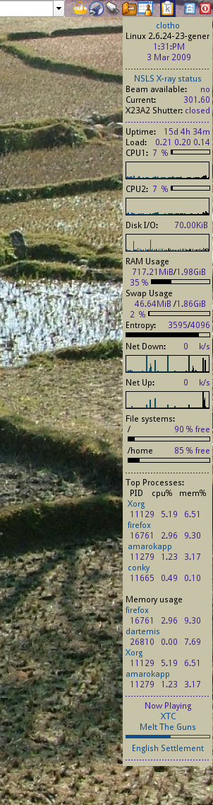

A Desktop Monitor for NSLS
==========================

On this page I describe how I set up a desktop monitoring system for
the status of my beamline at NSLS.  I want something of the "desktop
applet" variety to display the status of the NSLS ring in a manner
that is always present and always visible on my desktop.


## Conky

The solution I came up with uses
[Conky](http://conky.sourceforge.net/), a lightweight system monitor
for Linux and BSD.  Conky is not very flashy and it does not integrate
visually with KDE, GNOME, or any other desktop.  On the other hand, it
is easy to configure and easy to extend.  Building NSLS monitoring
tools required a few lines of perl and some simple manipulations of
the Conky configuration file.

## Components

The NSLS monitoring components make use of resources available at
[the NSLS machine status and history](http://www.nsls.bnl.gov/facility/machine/)
web page.  Each of these is implemented as a short perl script making
use of the excellent [LWP](http://search.cpan.org/~gaas/libwww-perl/)
package for web programming.  Each script ends by printing a short
message to standard output.  It is this message that gets displayed in
Conky.

### Beam available monitor

This monitor reads one of the
["device reading"](http://status.nsls.bnl.gov/cgi-bin/readdev.pl)
channels, which are simple HTTP tools to provide almost-real-time
feedback of a few selected ring parameters.  It prints "yes" or "no"
if beam is or is not available.

```perl
#!/usr/bin/perl
use strict;
use warnings;
use LWP::Simple;
my $xbeamavail = get 'http://status.nsls.bnl.gov/Status/Readback/xbeamavail';
my $available = sprintf("%d", $xbeamavail);
($available) ? print 'yes' : print 'no';
```

### Ring current monitor

This monitor reads another of the
["device reading"](http://status.nsls.bnl.gov/cgi-bin/readdev.pl)
channels, this one with the amount of current in the ring.

```perl
#!/usr/bin/perl
use strict;
use warnings;
use LWP::Simple;

my $xrcurr = get 'http://status.nsls.bnl.gov/Status/Readback/xrcurr';
my $current = (split(" ", $xrcurr))[0];
print $current;
```

### Shutter monitor

This monitor probes whether the X23A2 safety shutter is open or
closed.  This is a bit silly.  There is no direct way of determining
this that I know of.  What I do is download the image from the
[X-ray ring status](http://status.nsls.bnl.gov/Status/xstat.html)
page.  I then examine a pixel somewhere in the box indicating the
state of my safety shutter.  If that pixel is green, then this little
script prints "open".  If the pixel is some other color, it prints
"closed".  I use
[the Image::Imlib2](http://search.cpan.org/~lbrocard/Image-Imlib2)
module from CPAN to examine the state of the pixel in the gif image.

```perl
#!/usr/bin/perl
use strict;
use warnings;
use autodie qw(open close);

use Image::Imlib2;
use LWP::Simple;

my $gif = get 'http://status.nsls.bnl.gov/Status/images/Xstat.gif';
open my $G, ">/home/bruce/.conky/Xstat.gif";
print $G $gif;
close $G;

my $i = Image::Imlib2->load("/home/bruce/.conky/Xstat.gif");
# this is a pixel in X23A2's box
my ($r, $g, $b, $a) = $i->query_pixel(653,279);

(($r == 0) and ($g == 255) and ($b == 0)) ? print "open" : print "closed";
```

== Putting it all together ==

I then put the following lines in my Conky configuration file.  These
lines tell Conky to run the beam availability and current monitors
every 2 minutes (120 seconds) and to run the shutter monitor every 5
minutes.  These are on fairly long intervals just to keep traffic to
the NSLS server down to a reasonable level.

```
$stippled_hr
${alignc}${color2}NSLS X-ray status
${color black}Beam available: ${alignr}$color${execi 120 ~/.conky/nsls_available.pl}
${color black}Current: ${alignr}$color${execi 120 ~/.conky/nsls_current.pl}
${color black}X23A2 Shutter: ${alignr}$color${execi 600 ~/.conky/nsls_shutter.pl}
$stippled_hr
```

Here is what Conky looks like on my desktop.  The NSLS monitors can be
seen near the top.  Current had recently returned (hence the value
above 300 mA), but beam had not yet been announced.


