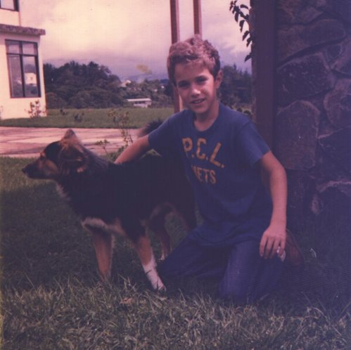
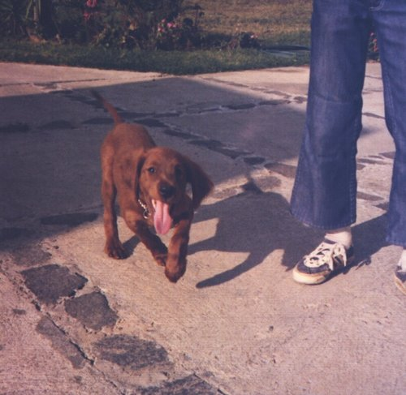
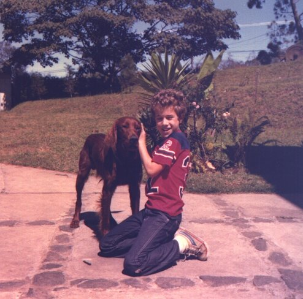
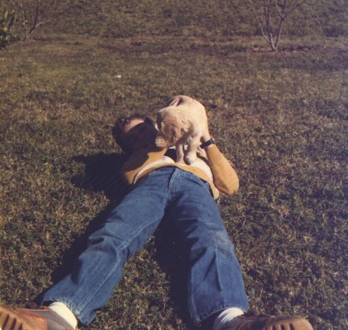

Mythology
=========

or: Why Bruce's programs are named after Greek goddesses
--------------------------------------------------------

When I was 9 years old, my father's work took my family to live in San
Jose, Costa Rica. We rented a big, beautiful house in the hills
overlooking San Jose. When we arrived at our new house, we found that
a stray dog named Muñeco (Spanish for "doll") already lived
there. Fortunately, he was willing to let us stay, so long as we fed
him. Muñeco was the first dog my family had ever had. I was
thrilled.  

Soon after moving in, we decided to invite another dog into our family
and one day my folks came home with an adorable Irish Setter puppy and
tasked me with naming the little guy. Around the time of my family's
move to Costa Rica, my mom had bought me a children's book of Greek
mythology, which I devoured. Armed with this wonderful book, there was
only one choice for my red-haired little puppy: Zeus. Here is
Zeus as I remember him as a puppy -- all floppy ears and kinetic
energy.

Zeus grew up to be a handsome, if rather thin and sickly, fellow. He
was as dumb as a bag of hammers, but endlessly friendly, cheerful, and
loyal. He was one of the best friends I have ever had.  Here's
the two of us in 1978.

Muñeco, fortunately, was a much smarter dog than Zeus. (It's hard to
imagine how he couldn't be!) Sadly, Muñeco had a character flaw. He
was a car chaser. One day, the gardener found him on the side of the
rode up the hill from our house. A passing car had taken a swipe at
him.

Needless to say, we were all devastated. Muñeco was a really amazing
dog and a special part of the family. We decided to get another dog
after he passed. My folks settled on a female cocker spaniel
puppy. There was only one choice for her name: Hera. This little cutie
pie is shown below. Sadly, Hera was not with us for long. A few
months after she arrived, she wondered off and got into trouble or was
stolen. We never saw her again and as far as I know, we never found
out what happened.

Eventually my family moved back to the States. We had to leave Zeus
behind. Given his various health problems, it would have been very
difficult to bring him to the States. We left him with friends who
lived down the hill. As I recall, he lived for a couple more years
before his health problems caught up with him.

Fast forward to 2001, and the cute little human in those pictures to
the right had grown up into a vastly less cute adult. I was visiting
the LNLS in Campinas, Brazil and had been thinking about a new EXAFS
software project. I sat down one day, opened XEmacs, and started
writing code. Needing a name for the program I was writing and being
on travel in Latin America, my thoughts drifted back to my gang of
four-legged, childhood friends. I decided that Athena, the goddess of
wisdom, was a good source of inspiration for my new project. A couple
months later, I let two of my colleagues try my new code and the name
stuck. As I fleshed out the suite of software, I worked my way through
the pantheon.

And that's why my codes are named after Greek goddesses. 
